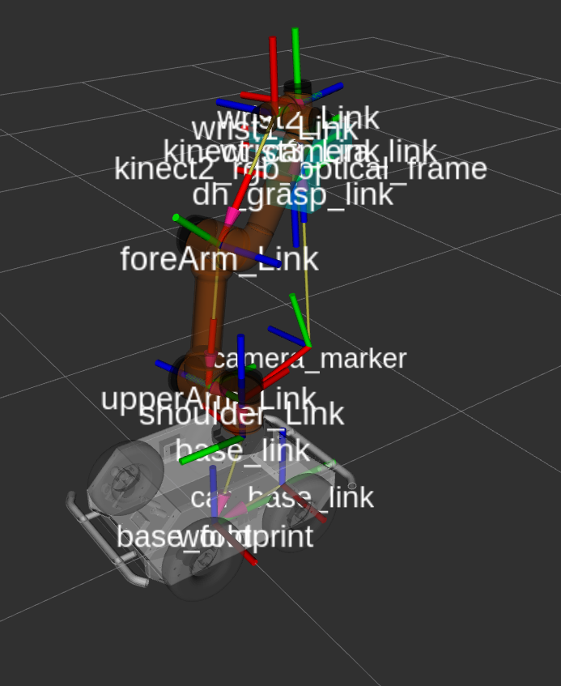
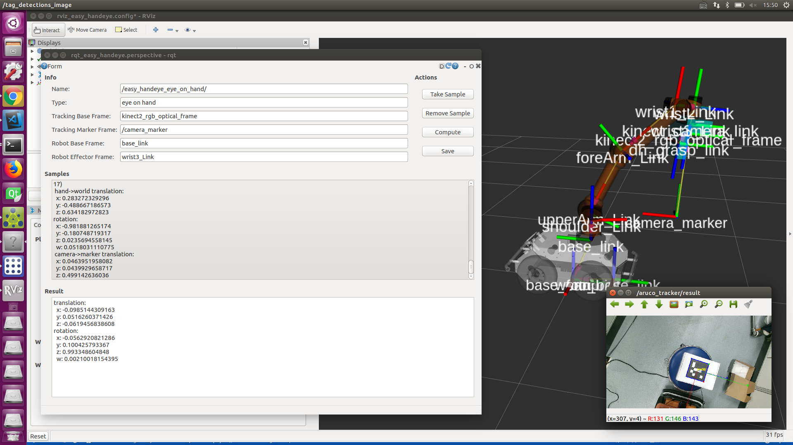

# 具体操作流程

## 参考博客
  
​<https://blog.csdn.net/zhang970187013/article/details/81098175>

​<https://blog.csdn.net/xu1129005165/article/details/83178122>

<https://zhuanlan.zhihu.com/p/33441113>

## 提前准备工作

安装好aruco_ros包，iai_kinect包，aubo_robot包,visp包，easy_handeye包


## 开始测试

```
roslaunch easy_handeye aubo_eye_hand_calibration.launch
```
 

## 运行流程

使用easy_handeye首先需要把UR5跟kinect2跑起来. 然后, 用aruco_ros识别末端上的标志物, 得到camera_link到marker_link的转换. 之后按照GUI控制机械臂在相机视野内产生16个姿态, 每次都把样本记录下来. 这16个姿态是第一步计算好的, 在开始姿态前后左右上下8个位置各2个角度. 最后点击求解, easy_handeye会调用visp的代码得到标定结果. 然后点save, 标定结果会被保存在~/.ros/easy_handeye/---.yaml. 之后就可以关掉标定程序,再跑publish.launch即可发布base_link到camera_link的转换.

## 标定过程


 




## 标定结果


标定结果
```
translation: 
  x: -0.0985144309163
  y: 0.0516260371426
  z: -0.0619456838608
rotation: 
  x: -0.0562920821286
  y: 0.100425793367
  z: 0.993348604848
  w: 0.00210018154395
```